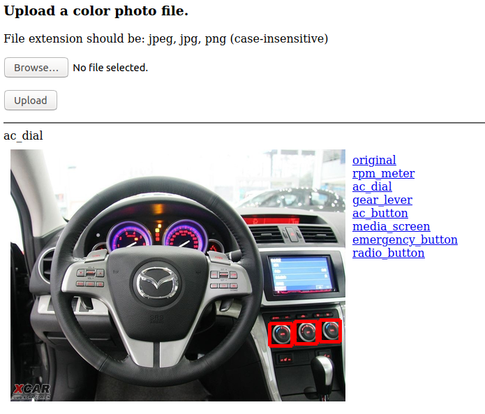

# TensorFlow Object Detection API demo

Disclaimer: This is not an official Google product.

This is an example application demonstrating how
 [TensorFlow Object Detection API][1] and [pretrained models][2]
 can be used to create a general object detection service.

## Products
- [TensorFlow][3]
- [Google Compute Engine][4]

## Language
- [Python][5]

[1]: https://github.com/tensorflow/models/tree/master/research/object_detection
[2]: https://github.com/tensorflow/models/blob/master/research/object_detection/g3doc/detection_model_zoo.md
[3]: https://www.tensorflow.org/
[4]: https://cloud.google.com/compute/
[5]: https://python.org

## Prerequisites
1. A Google Cloud Platform Account
2. [A new Google Cloud Platform Project][6] for this lab with billing enabled

[6]: https://console.developers.google.com/project

## Do this first
First you launch a GCE instance with the following configuration.

- vCPU x 8
- Memory 8GB
- Debian GNU/Linux 9 as a guest OS
- Allow HTTP traffic
- Assign a static IP address

You can leave other settings as default. Once the instance has started,
 log in to the guest OS using SSH and change the OS user to root.

```
$ sudo -i
```

All remaining operations should be done from the root user.

## Install packages

```
# apt-get update
# apt-get install -y protobuf-compiler python3-pil python3-lxml python3-pip python3-dev git
# pip3 install -U pip
# python3 -m pip install Flask==1.1.1 WTForms==2.2.1 Flask_WTF==0.14.2 Werkzeug==0.16.0 tensorflow==2.0.0
```

## Install the Object Detection API library

```
# cd /opt
# git clone https://github.com/tensorflow/models
# cd models/research
# protoc object_detection/protos/*.proto --python_out=.
```

## Install the demo application

```
# cd $HOME
# git clone https://github.com/GoogleCloudPlatform/tensorflow-object-detection-example
# cp -a tensorflow-object-detection-example/object_detection_app_p3 /opt/
# chmod u+x /opt/object_detection_app_p3/app.py
# cp /opt/object_detection_app_p3/object-detection.service /etc/systemd/system/
```

This application provides a simple user authentication mechanism.
 You can change the username and password by modifying the following
 part in `/opt/object_detection_app_p3/decorator.py`.

```
USERNAME = 'username'
PASSWORD = 'passw0rd'
```

## Launch the demo application

```
# systemctl daemon-reload
# systemctl enable object-detection
# systemctl start object-detection
# systemctl status object-detection
```

The last command outputs the application status, as in the
 following example:
```
● object-detection.service - Object Detection API Demo
   Loaded: loaded (/etc/systemd/system/object-detection.service; enabled; vendor preset: enabled)
   Active: active (running) since Thu 2020-01-02 23:55:17 UTC; 38s ago
 Main PID: 17136 (python3)
    Tasks: 29 (limit: 4915)
   CGroup: /system.slice/object-detection.service
           └─17136 python3 /opt/object_detection_app_p3/app.py

Jan 02 23:55:32 od-test app.py[17136]: 2020-01-02 23:55:32.930129: I tensorflow/core/platform/cpu_feature_guard.cc:142] You
Jan 02 23:55:32 od-test app.py[17136]: 2020-01-02 23:55:32.936310: I tensorflow/core/platform/profile_utils/cpu_utils.cc:94
Jan 02 23:55:32 od-test app.py[17136]: 2020-01-02 23:55:32.937050: I tensorflow/compiler/xla/service/service.cc:168] XLA se
Jan 02 23:55:32 od-test app.py[17136]: 2020-01-02 23:55:32.937078: I tensorflow/compiler/xla/service/service.cc:175]   Stre
Jan 02 23:55:40 od-test app.py[17136]:  * Serving Flask app "app" (lazy loading)
Jan 02 23:55:40 od-test app.py[17136]:  * Environment: production
Jan 02 23:55:40 od-test app.py[17136]:    WARNING: This is a development server. Do not use it in a production deployment.
Jan 02 23:55:40 od-test app.py[17136]:    Use a production WSGI server instead.
Jan 02 23:55:40 od-test app.py[17136]:  * Debug mode: off
Jan 02 23:55:40 od-test app.py[17136]:  * Running on http://0.0.0.0:80/ (Press CTRL+C to quit)
```

You have to wait around 60secs for the application to finish loading
 the pretrained model graph. You'll see the message 
 `Running on http://0.0.0.0:80/ (Press CTRL+C to quit)` when it's ready.

Now you can access the instance's static IP address using a web browser.
 When you upload an image file with a `jpeg`, `jpg`, or `png` extension,
 the application shows the result of the object detection inference.
 The inference may take up to 30 seconds, depending on the image.

The following example shows "cup" in the image. You can also check
 other objects such as fork, dining table, person and knife by clicking
 labels shown to the right of the image.

 

(Image from http://www.ashinari.com/en/)

## How to use different models
There are pretrained models that can be used by the application.
 They have diffrent characteristics in terms of accuracy and speed.
 You can change the model used by the application with the following
 steps.

1. Choose one of COCO-trained models from [Tensorflow detection model zoo][7]. (The "Outputs" column should be "Boxes".)
2. Copy an URL of the model from a link on the "Model name" column.
3. Open `/opt/object_detection_app_p3/app.py` and replace the URL in the following part.

```
MODEL_URL = 'http://download.tensorflow.org/models/object_detection/faster_rcnn_resnet50_coco_2018_01_28.tar.gz'
```

4. Restart the application with the following command.

```
# systemctl restart object-detection
```

[7]: https://github.com/tensorflow/models/blob/master/research/object_detection/g3doc/detection_model_zoo.md
